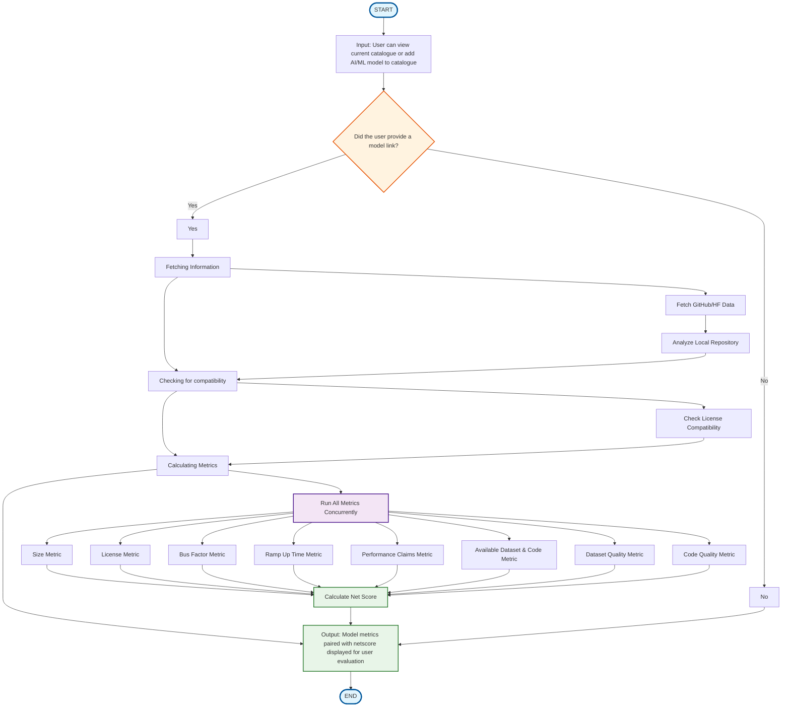

# AI Model Catalog - Activity Diagram

## Updated Activity Diagram (Reflecting Final Implementation)

## Key Changes from Initial Design:

### **Faithful to Original Design:**
- ✅ **Core Flow Preserved**: Maintains the original START → Input → Decision → Fetch/Check/Calculate → Output → END flow
- ✅ **Decision Point**: Keeps the "Did the user provide a model link?" decision structure
- ✅ **Convergence**: Both paths (Yes/No) still converge at the Output stage
- ✅ **User-Centric**: Focus remains on user evaluation and model selection

### **Enhanced Implementation Details:**
1. **Detailed Fetching Process**: 
   - Original: "Fetching Information" 
   - Enhanced: Fetch GitHub/HF Data → Analyze Local Repository (GitPython integration)

2. **Enhanced Compatibility Checking**:
   - Original: "Checking for compatibility"
   - Enhanced: Check License Compatibility (LGPLv2.1 strict compliance)

3. **Detailed Metrics Calculation**:
   - Original: "Calculating Metrics"
   - Enhanced: Run All Metrics Concurrently → Individual Metric Calculations → Net Score

4. **Added Technical Enhancements**:
   - **Concurrent Execution**: Parallel metric processing for performance
   - **Error Isolation**: Comprehensive error handling with graceful degradation
   - **Rate Limiting**: Token-based API rate limiting
   - **Multiple Output Formats**: Text and NDJSON support
   - **Local Analysis**: GitPython integration for repository analysis

### **Design Validation:**
The final implementation successfully realizes your original design vision while adding robust technical capabilities. The core user experience and decision flow remain unchanged, demonstrating good design evolution from concept to implementation.
