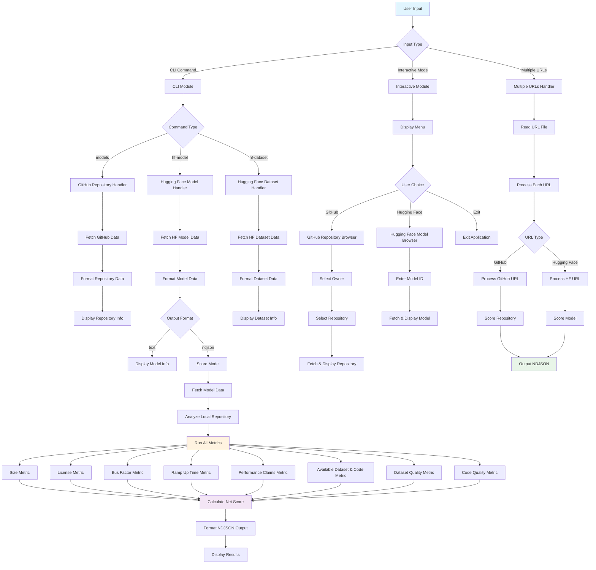

# AI Model Catalog - Activity Diagram

## Updated Activity Diagram (Reflecting Final Implementation)

## Key Changes from Initial Design:

1. **Added Local Repository Analysis**: GitPython integration for cloning and analyzing HF repositories
2. **Enhanced Error Handling**: Comprehensive error isolation and graceful degradation
3. **Multiple Output Formats**: Support for both text and NDJSON output formats
4. **Rate Limiting**: Token-based API rate limiting with fallback mechanisms
5. **Concurrent Metric Execution**: Parallel execution of scoring metrics for performance
6. **Interactive Mode**: Enhanced interactive browsing capabilities
7. **Multiple URL Processing**: Batch processing of multiple URLs from file input
