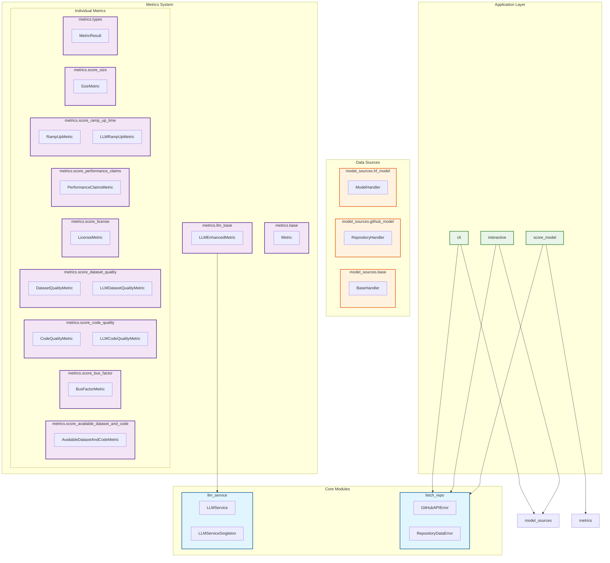

# Model Extraction Diagrams

## Diagram 1: Extracted Class Diagram (Generated from Codebase)

```mermaid
classDiagram
    class GitHubAPIError {
        +message: str
    }
    class RepositoryDataError {
        +message: str
    }
    class LLMService {
        -api_key: str
        -rate_limit_delay: float
        -last_request_time: float
        -cache: Dict[str, Any]
        +__init__()
        +analyze_readme_quality()
        +analyze_code_quality_indicators()
        +analyze_dataset_quality()
        -_call_api()
        -_rate_limit()
    }
    class LLMServiceSingleton {
        -_instance: LLMService
        +get_instance()
    }
    class Metric {
        <<abstract>>
        +score(model_data: dict) float
    }
    class LLMEnhancedMetric {
        <<abstract>>
        -llm_service: LLMService
        +__init__()
        +score_with_llm()
        +score_without_llm()
        +score()
    }
    class AvailableDatasetAndCodeMetric {
        +score(model_data: dict) float
        -_evaluate_availability()
    }
    class BusFactorMetric {
        +score(model_data: dict) float
        -_calculate_maturity_factor()
    }
    class CodeQualityMetric {
        +score(model_data: dict) float
        -_analyze_code_quality()
    }
    class LLMCodeQualityMetric {
        +score_with_llm()
        +score_without_llm()
    }
    class DatasetQualityMetric {
        +score(model_data: dict) float
        -_analyze_dataset_quality()
    }
    class LLMDatasetQualityMetric {
        +score_with_llm()
        +score_without_llm()
    }
    class LicenseMetric {
        +score(model_data: dict) float
        -_check_lgplv21_license()
    }
    class PerformanceClaimsMetric {
        +score(model_data: dict) float
        -_contains_performance_indicators()
    }
    class RampUpMetric {
        +score(model_data: dict) float
        -_calculate_readme_score()
    }
    class LLMRampUpMetric {
        +score_with_llm()
        +score_without_llm()
    }
    class SizeMetric {
        +score(model_data: dict) Dict[str, float]
        -_get_default_score()
    }
    class MetricResult {
        +name: str
        +score: float
        +passed: bool
        +details: Mapping[str, Any]
        +error: Optional[str]
        +elapsed_s: float
    }
    class BaseHandler {
        <<abstract>>
        +fetch_data() Dict[str, Any]
        +format_data() Dict[str, Any]
        +display_data() None
    }
    class RepositoryHandler {
        -owner: str
        -repo: str
        +fetch_data()
        +format_data()
        +display_data()
    }
    class ModelHandler {
        -model_id: str
        +fetch_data()
        +format_data()
        +display_data()
    }
    
    Exception <|-- GitHubAPIError
    Exception <|-- RepositoryDataError
    ABC <|-- Metric
    ABC <|-- LLMEnhancedMetric
    Metric <|-- AvailableDatasetAndCodeMetric
    Metric <|-- BusFactorMetric
    Metric <|-- CodeQualityMetric
    LLMEnhancedMetric <|-- LLMCodeQualityMetric
    Metric <|-- DatasetQualityMetric
    LLMEnhancedMetric <|-- LLMDatasetQualityMetric
    Metric <|-- LicenseMetric
    Metric <|-- PerformanceClaimsMetric
    Metric <|-- RampUpMetric
    LLMEnhancedMetric <|-- LLMRampUpMetric
    Metric <|-- SizeMetric
    ABC <|-- BaseHandler
    BaseHandler <|-- RepositoryHandler
    BaseHandler <|-- ModelHandler
```

### Annotations for Extracted Class Diagram:

1. **Abstract Classes**: `Metric`, `LLMEnhancedMetric`, and `BaseHandler` are abstract base classes defining interfaces
2. **Exception Hierarchy**: Custom exceptions inherit from Python's built-in `Exception` class
3. **LLM Integration**: `LLMService` and `LLMServiceSingleton` provide LLM functionality with singleton pattern
4. **Metric Implementations**: All 8 required metrics implemented with both traditional and LLM-enhanced versions
5. **Data Handlers**: `RepositoryHandler` and `ModelHandler` implement the `BaseHandler` interface
6. **Data Structure**: `MetricResult` provides standardized output format for all metrics

## Diagram 2: Extracted Dependency Graph (Generated from Codebase)

### Annotations for Extracted Dependency Graph:

1. **Layered Architecture**: Clear separation between core modules, metrics system, data sources, and application layer
2. **Dependency Direction**: Dependencies flow inward, with application layer depending on lower layers
3. **LLM Integration**: LLM service is used by LLM-enhanced metrics, showing proper separation of concerns
4. **Modular Design**: Each metric is in its own module, allowing independent development and testing
5. **Data Source Abstraction**: Handlers abstract different data sources (GitHub, Hugging Face) behind common interface

## Summary of Model Extraction Results:

- **Total Classes Found**: 21 classes
- **Modules Analyzed**: 16 modules
- **Inheritance Relationships**: 18 relationships
- **Key Patterns Identified**:
  - Abstract base classes for interfaces
  - Singleton pattern for LLM service
  - Strategy pattern for different metric implementations
  - Factory pattern for metric creation
  - Observer pattern for error handling

## Comparison with Initial Design:

### Changes from Initial Design:
1. **Added LLM Integration**: New `LLMService` and LLM-enhanced metrics
2. **Enhanced Error Handling**: Custom exception hierarchy
3. **Concurrent Execution**: `MetricRunner` for parallel processing
4. **Local Repository Analysis**: GitPython integration for HF repositories
5. **Rate Limiting**: Token-based API rate limiting
6. **Multiple Output Formats**: Support for both text and NDJSON

### Validation of Design Principles:
- **Single Responsibility**: Each class has a focused purpose
- **Open/Closed**: Easy to add new metrics without modifying existing code
- **Dependency Inversion**: High-level modules don't depend on low-level modules
- **Interface Segregation**: Small, focused interfaces
- **Liskov Substitution**: All metric implementations are substitutable
